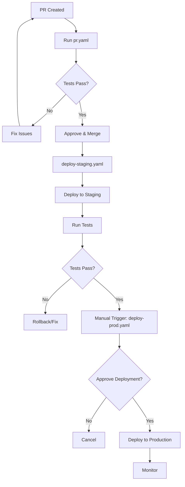

# GitHub Actions CI/CD Workflows

This directory contains GitHub Actions workflows for the multi-agent system deployment pipeline.

## Overview

These workflows provide a complete CI/CD pipeline using GitHub Actions with Workload Identity Federation (WIF) for secure authentication to Google Cloud Platform.

## Workflow Files

### 1. `pr.yaml` - Pull Request Validation

**Triggers:** Pull requests to `main` branch

**Jobs:**
- **lint** - Code quality checks
  - Ruff linter and formatter
  - mypy type checking
  - codespell
- **test-unit** - Unit test execution with coverage
- **test-integration** - Integration test suite
- **security-scan** - Security vulnerability scanning
  - Safety dependency check
  - TruffleHog secret scanning
- **terraform-validate** - Infrastructure validation
- **pr-summary** - Automated PR comment with results

**Features:**
- Parallel job execution for speed
- Coverage reports uploaded to Codecov
- Automated PR comments with test results
- Cancels in-progress runs when new commits pushed

**Example Output:**
```
## PR Validation Results

| Check | Status |
|-------|--------|
| Lint | ✅ success |
| Unit Tests | ✅ success |
| Integration Tests | ✅ success |
| Security Scan | ✅ success |
| Terraform Validation | ✅ success |

---
**Commit:** abc1234
**PR:** #42
```

### 2. `deploy-staging.yaml` - Staging Deployment

**Triggers:**
- Push to `main` branch
- Manual workflow dispatch

**Jobs:**

1. **deploy-agent-engine** - Deploy to Staging
   - Authenticate with WIF
   - Install dependencies
   - Export requirements
   - Deploy to Agent Engine
   - Verify deployment

2. **smoke-tests** - Quick validation
   - Run smoke test suite
   - Validate basic functionality

3. **load-test** - Performance validation
   - Run Locust load tests (60s, 5 users)
   - Upload results to GCS
   - Archive results as artifacts

4. **health-check** - Monitoring
   - Check error logs
   - Verify telemetry collection
   - Alert on anomalies

5. **deployment-summary** - Report generation
   - GitHub Actions summary
   - Quick links to GCP console

6. **notify-slack** - Notifications (optional)
   - Send deployment status to Slack

**Environment:** `staging`

**Concurrency:** Only one staging deployment at a time

**Example Usage:**

```bash
# Automatic: merge PR to main
git checkout main
git merge feature-branch
git push origin main

# Manual: trigger via GitHub UI or CLI
gh workflow run deploy-staging.yaml
```

### 3. `deploy-prod.yaml` - Production Deployment

**Triggers:**
- Manual workflow dispatch only
- Optionally on tag creation (`v*.*.*`)

**Jobs:**

1. **pre-deployment-checks** - Validation
   - Verify staging deployment exists
   - Check error rates in staging
   - Validate no open incidents

2. **deploy-production** - Production deployment
   - **REQUIRES MANUAL APPROVAL** (configured in environment settings)
   - Create deployment record
   - Deploy to Production Agent Engine
   - Verify deployment
   - Update deployment status

3. **post-deployment-validation** - Safety checks
   - Run production smoke tests
   - Monitor for immediate errors (2 minutes)
   - Fail if error threshold exceeded

4. **rollback-procedure** - Incident response
   - Display rollback instructions on failure
   - Provide quick recovery steps

5. **deployment-summary** - Comprehensive report
   - Deployment details
   - Validation results
   - Post-deployment checklist

6. **notify-on-success** / **notify-on-failure** - Notifications
   - Slack notifications with deployment status

**Environment:** `production` (requires approval)

**Concurrency:** Only one production deployment, never cancelled

**Safety Features:**
- Manual approval gate before deployment
- Pre-flight validation checks
- Staging verification required
- Post-deployment monitoring
- Automated rollback instructions
- Deployment audit trail

**Example Usage:**

```bash
# Manual deployment via GitHub UI
# 1. Go to Actions > Deploy to Production
# 2. Click "Run workflow"
# 3. Optionally specify commit SHA from staging
# 4. Approve when requested

# Or via GitHub CLI
gh workflow run deploy-prod.yaml -f staging_commit_sha=abc1234

# Or create a release tag
git tag v1.0.0
git push origin v1.0.0
```

## Setup Instructions

### 1. Configure Workload Identity Federation

WIF must be set up by Terraform. Verify it exists:

```bash
# Check WIF pool
gcloud iam workload-identity-pools describe github-pool \
  --project=YOUR_CICD_PROJECT_ID \
  --location=global

# Check WIF provider
gcloud iam workload-identity-pools providers describe github-provider \
  --workload-identity-pool=github-pool \
  --project=YOUR_CICD_PROJECT_ID \
  --location=global
```

### 2. Set Up GitHub Secrets

Required secrets (set in repository Settings > Secrets and variables > Actions):

```bash
# Required Secrets
WIF_POOL_ID          # Workload Identity Pool ID
WIF_PROVIDER_ID      # Workload Identity Provider ID
GCP_SERVICE_ACCOUNT  # CI/CD service account email
```

### 3. Set Up GitHub Variables

Required variables (set in repository Settings > Secrets and variables > Actions):

```bash
# Required Variables
GCP_PROJECT_NUMBER         # CI/CD project number
CICD_PROJECT_ID            # CI/CD project ID
STAGING_PROJECT_ID         # Staging project ID
PROD_PROJECT_ID            # Production project ID
REGION                     # GCP region (e.g., us-central1)
LOGS_BUCKET_NAME_STAGING   # Staging logs bucket
LOGS_BUCKET_NAME_PROD      # Production logs bucket
ARTIFACT_REGISTRY_REPO_NAME # Artifact registry repository name
CONTAINER_NAME             # Container/service name

# Optional Variables
SLACK_WEBHOOK_URL          # For Slack notifications
```

### 4. Configure Production Environment Protection

**CRITICAL:** Set up manual approval for production deployments:

1. Go to repository **Settings > Environments**
2. Click on the **production** environment (auto-created by workflows)
3. Under **Protection rules**:
   - ✅ Check **Required reviewers**
   - Add specific users or teams who can approve
   - Optionally set wait timer (e.g., 5 minutes minimum)
4. Click **Save protection rules**

Now production deployments will pause and wait for approval.

### 5. Set Up Branch Protection

Protect the `main` branch:

1. Go to repository **Settings > Branches**
2. Add rule for `main`
3. Configure:
   - ✅ Require pull request reviews
   - ✅ Require status checks to pass
     - Select: `lint`, `test-unit`, `test-integration`
   - ✅ Require conversation resolution
   - ✅ Do not allow bypassing

## Workflow Permissions

Each workflow uses specific permissions following the principle of least privilege:

```yaml
permissions:
  contents: read        # Read repository contents
  id-token: write       # Create OIDC tokens for WIF
  pull-requests: write  # Comment on PRs (pr.yaml only)
  deployments: write    # Create deployment records (prod only)
```

## Monitoring Workflows

### View Workflow Runs

```bash
# List recent workflow runs
gh run list --limit 10

# View specific run details
gh run view RUN_ID

# Watch a running workflow
gh run watch RUN_ID

# View workflow logs
gh run view RUN_ID --log
```

### GitHub Actions UI

- All Workflows: `https://github.com/YOUR_ORG/YOUR_REPO/actions`
- Specific Run: `https://github.com/YOUR_ORG/YOUR_REPO/actions/runs/RUN_ID`

### Deployment History

View deployment history in the **Environments** section:

`https://github.com/YOUR_ORG/YOUR_REPO/deployments`

## Customization

### Add Environment Variables

Add to the workflow file:

```yaml
env:
  MY_CUSTOM_VAR: value

jobs:
  my-job:
    env:
      JOB_SPECIFIC_VAR: value
```

### Add Workflow Steps

```yaml
- name: My custom step
  run: |
    echo "Custom logic"
    ./scripts/my-script.sh
```

### Modify Test Timeouts

```yaml
- name: Run tests
  run: pytest tests/ --timeout=300
  timeout-minutes: 10
```

### Add Slack Notifications

1. Create Slack incoming webhook
2. Add `SLACK_WEBHOOK_URL` to GitHub variables
3. Workflows will automatically send notifications

## Deployment Workflow



## Troubleshooting

### Authentication Fails

**Error:** `Error: google-github-actions/auth failed with: retry function failed after 1 attempt(s)`

**Solution:**
```bash
# Verify WIF setup
gcloud iam service-accounts describe YOUR_SA_EMAIL

# Check bindings
gcloud iam service-accounts get-iam-policy YOUR_SA_EMAIL
```

### Tests Fail in CI but Pass Locally

**Common causes:**
1. Missing environment variables
2. Different Python version
3. Missing GCP permissions

**Debug:**
```yaml
- name: Debug environment
  run: |
    echo "Python: $(python --version)"
    env | sort
    gcloud auth list
```

### Deployment Timeouts

**Increase timeout:**
```yaml
timeout-minutes: 30  # Default is 360 (6 hours)
```

### Load Tests Fail

**Check:**
1. Locust is installed: `pip list | grep locust`
2. Test file exists: `ls tests/load_test/load_test.py`
3. Auth token is valid: `gcloud auth print-access-token`

### Production Approval Not Required

**Verify environment protection:**
1. Go to Settings > Environments > production
2. Ensure "Required reviewers" is checked
3. Add at least one reviewer

## Best Practices

1. **Never Skip CI Checks**: Always run full test suite before merge
2. **Use Manual Approval**: Production should always require human approval
3. **Monitor After Deployment**: Check dashboards for 24 hours post-deployment
4. **Keep Secrets Secure**: Never commit secrets, use GitHub Secrets
5. **Use WIF, Not Keys**: Avoid service account keys, use Workload Identity Federation
6. **Version Everything**: Tag releases with semantic versioning
7. **Document Changes**: Update changelog and deployment notes
8. **Test Rollback**: Regularly practice rollback procedures

## Performance Tips

### Speed Up Workflows

1. **Use caching** for dependencies:
```yaml
- uses: actions/setup-python@v5
  with:
    python-version: '3.12'
    cache: 'pip'  # Cache pip dependencies
```

2. **Run jobs in parallel** when possible
3. **Use `continue-on-error`** for non-critical steps
4. **Limit log output** to avoid clutter

### Reduce Costs

1. **Cancel in-progress runs** for PR updates:
```yaml
concurrency:
  group: pr-${{ github.event.pull_request.number }}
  cancel-in-progress: true
```

2. **Use smaller runners** for simple tasks
3. **Set appropriate timeouts** to avoid hung jobs

## Related Documentation

- [Workload Identity Federation Setup](../../deployment/terraform/wif.tf)
- [Cloud Build Alternative](../../.cloudbuild/README.md)
- [Agent Starter Pack Best Practices](../../docs/analysis/06_best_practices_summary.md)
- [GitHub Actions Documentation](https://docs.github.com/en/actions)

## Support

For issues or questions:
1. Check workflow logs in GitHub Actions UI
2. Review [GitHub Actions documentation](https://docs.github.com/en/actions)
3. Check Agent Starter Pack documentation
4. Contact your DevOps team
